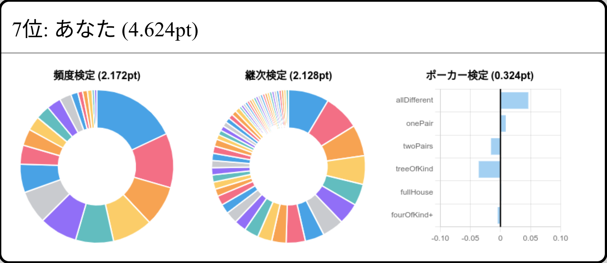

# あなたは乱数生成器ですか？

もしあなたが乱数生成器であると主張するのであれば、ここで証明することができます。

https://are-you-rng.game.burion.net/

# 遊び方

`0123456789abcdefghijklmnopqrstuvwxyz` をランダムに打つ、ただそれだけです。

スコアは誤差を表しており、 0 に近いほど良い値です。

# 評価の読み方

## 頻度検定

それぞれ出現した文字の頻度を評価します。あなたが完璧な乱数生成器であればすべての文字はほぼ同じ確率で出てくるでしょう。

円グラフの幅が等しければ等しい程いい乱数と評価されます。

## 継次検定

文字の並び方の出現頻度を評価します。あなたが完璧な乱数生成器であれば「0 の次に 1 が出る確率」「 0 の次に 1 が出る確率」「0 の次に 2 が出る確率」...は全て等しくなるはずです。[^1]

円グラフの幅が等しければ等しい程いい乱数と評価されます。

## ポーカー検定

5 個の数字に着目したときのパターンの出現頻度を評価します。あなたが完璧な乱数生成器であれば理論値と同じ確率でパターンが出現するはずです。[^1]

棒グラフは理論値との誤差を表しており、0 に近ければ近いほど良い乱数と評価されます。

[^1]: 評価に利用できるデータが少ない関係で文字の種類を圧縮（ 36 種類-> 9 種類 ）しているため、表示されるラベルと実際の値はズレています。
